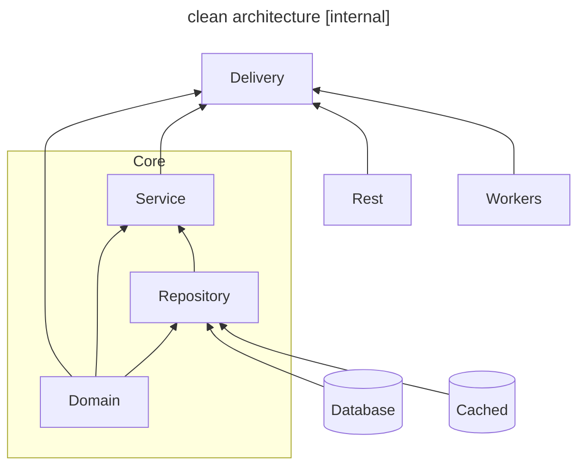
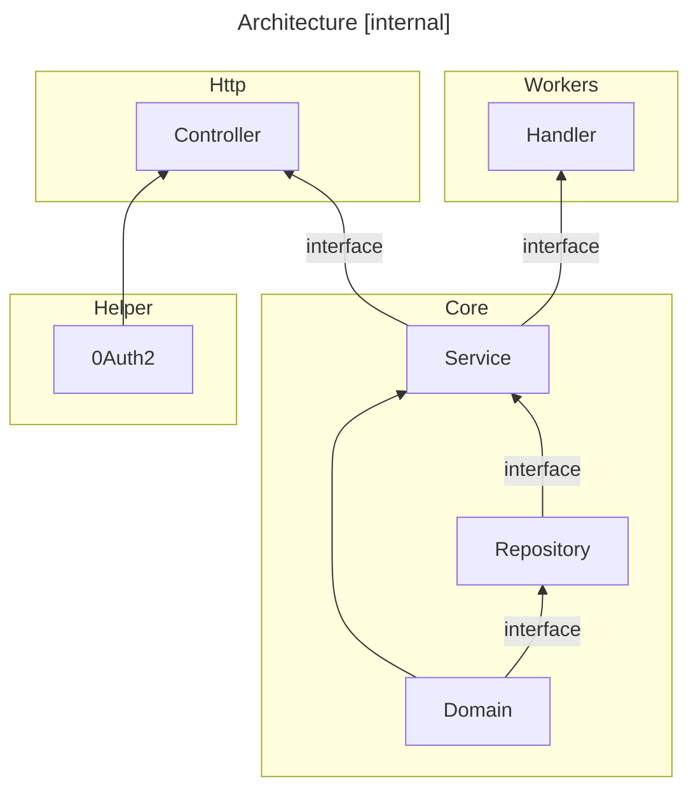

# Swipe API `swiple-api/internal` GuildLines

## Overview

This document describes how you can use the scripts from [`internal`](.) directory and gives a brief introduction and explanation of these scripts.

## Clean Architecture

## Architecture Diagram

## Key Folder

[`domain`](./core/domain/) : This is the first layer in clean architecture, where data types for other layers are described

[`repo`](./core/repo/): This is the second layer of the architecture, where queries to the database are processed.

[`service`](./core/service/): This is the third layer of the architecture, where the business logic of the application is implemented.

## Attention

[`workers`](./workers/): This directory implements worker functions linked to the [`boot`](./boot/) directory, utilizing message passing via Redis protocol. The worker server will run continuously and execute upon receiving requests from the central server.

[`http`](./http/): This directory implements the functionalities of the central server with the primary protocol being HTTP through APIs.

[`tasks`](./tasks): This directory implements business functionalities and sends them to workers via Redis.

[`helper`](./helper/): This directory stores auxiliary functions for the application.
